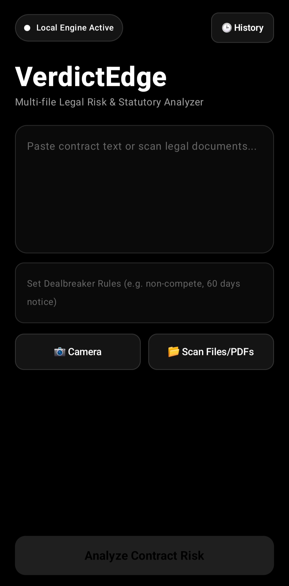
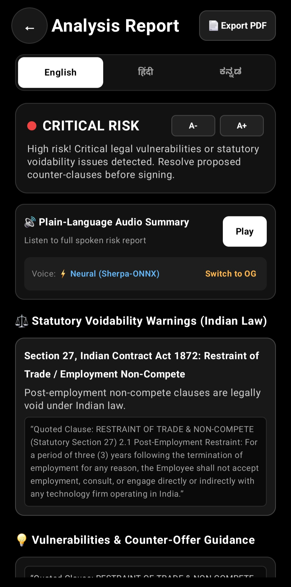
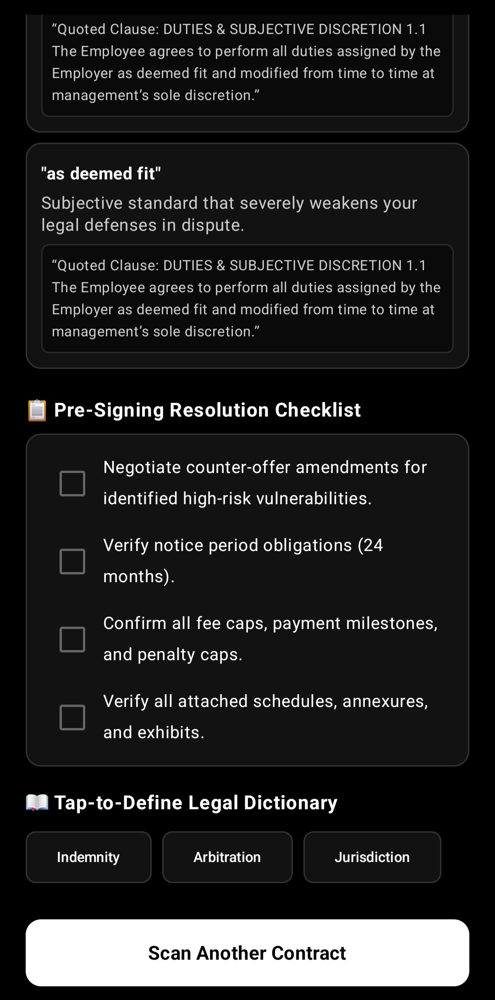
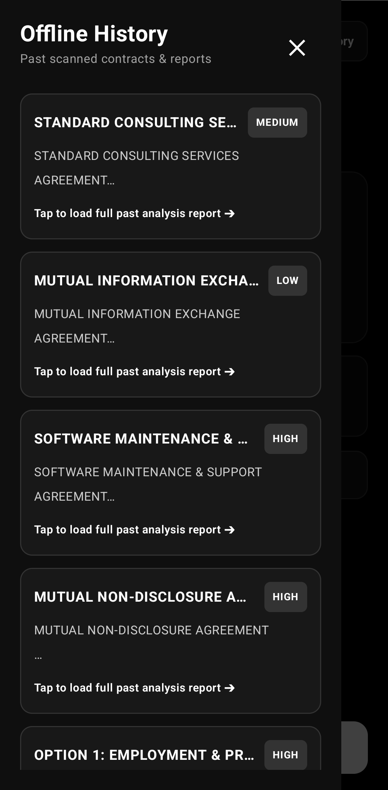
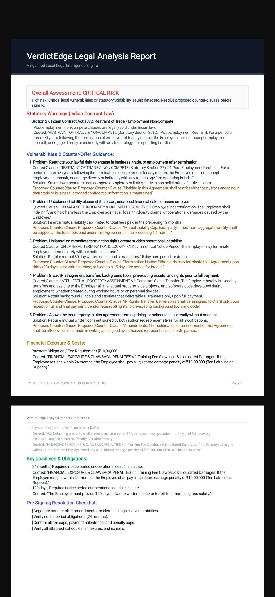
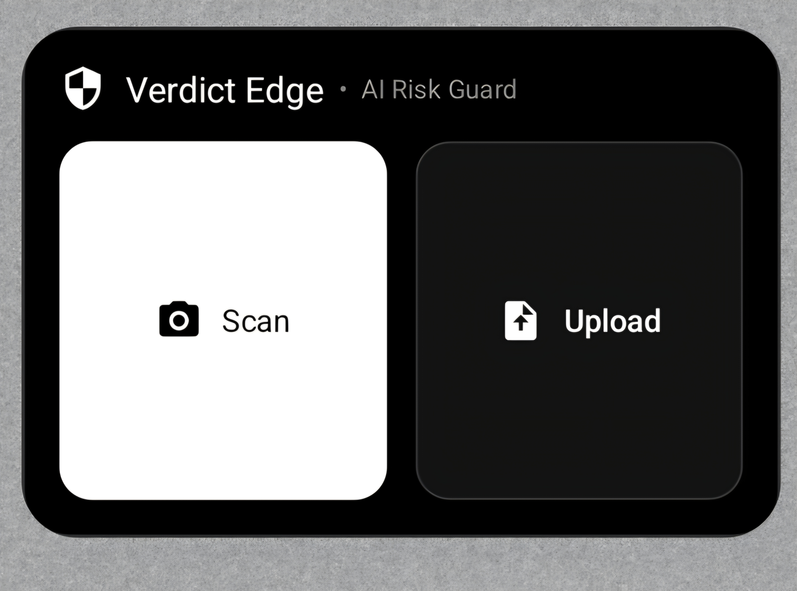

# VerdictEdge 

> **Air-Gapped, On-Device Legal Risk & Statutory Analyzer for Android**

VerdictEdge is a fully offline, privacy-first legal intelligence mobile platform. Powered by Google MediaPipe, on-device Gemma 2B LLM inference, Google ML Kit OCR, and local Neural Text-to-Speech (Sherpa-ONNX), VerdictEdge scans, parses, and identifies high-risk clauses, financial exposures, statutory voidability, and custom dealbreakers without sending a single byte to external servers.

---

## 📽️ Demo & Visuals

### App Demo

  

---

### App Screenshots

| Input & Quick Scan | Comprehensive Analysis | Legal Warnings & Checklist |
| :---: | :---: | :---: |
|  |  |  |

| Offline Scan History | Export PDF Report | Home Screen Widget |
| :---: | :---: | :---: |
|  |  |  |

---

## ⚡ Core Features

* **100% On-Device & Air-Gapped:** Zero cloud dependencies. All OCR text extraction, contract evaluation, risk scoring, and audio summary synthesis happen locally.
* **Gemma 2B + Rule Engine Analysis:** Combines on-device Gemma 2B via MediaPipe LLM Inference API with precise rule-based parsing to evaluate liabilities, indemnities, unilateral terminations, and IP assignment clauses.
* **Statutory Voidability Detection (Indian Law):** Built-in legal rules flag illegal contract clauses under the **Indian Contract Act, 1872** (e.g., Section 27 Restraint of Trade, Section 28 Restraint of Legal Proceedings).
* **Multi-Format & Multi-Doc OCR:** Scan single physical contract pages using the high-resolution camera or parse multi-page PDFs using Google ML Kit.
* **Custom Dealbreaker Rules:** Input custom user constraints (e.g., *"60 days notice period"*, *"non-compete"*) to instantly evaluate compliance across multi-page agreements.
* **Neural & System Multilingual TTS:** Instant audio summaries rendered in **English**, **Hindi (हिंदी)**, and **Kannada (ಕನ್ನಡ)**. Supports both Sherpa-ONNX Neural TTS models and Android System TTS with currency and symbol normalization.
* **Pre-Signing Checklist & Counter-Offers:** Generates proposed counter-clause drafts to restore balance in lopsided contracts, paired with an interactive pre-signing resolution checklist.
* **PDF Report Generation:** Export full, structured PDF reports directly to local storage for offline archival or sharing.
* **Home Screen Quick Scan Widget:** Android App Widget for immediate one-tap camera scanning or document uploading directly from the home screen.

---

## 🏗️ System Architecture

